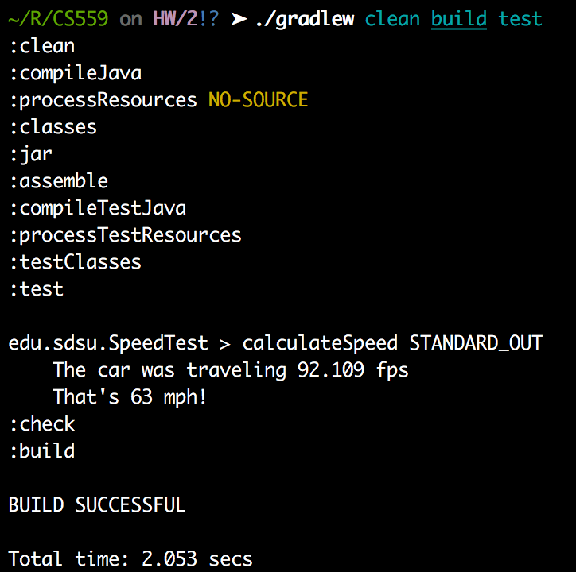

### Running Programs
Each program has an associated JUnit Unit Test in the `src/test` directory, which tests the specified program for the outlined parameters. These unit tests can be run via the Gradle Dependency and Build tool, whose wrapper is included in the root directory of this project.

Running the line below in a Unix terminal while at the root directory of the project will execute all of the unit tests and show the results:
`./gradlew clean build test`

