CS-559 Homework 4
=================

## 1. FFT
### A - Image Size
Since FFT breaks the image down into n/2 sections in order the efficiently transform the image from the spatial domain into the frequency domain, we need to have the image dimensions be a power of two.

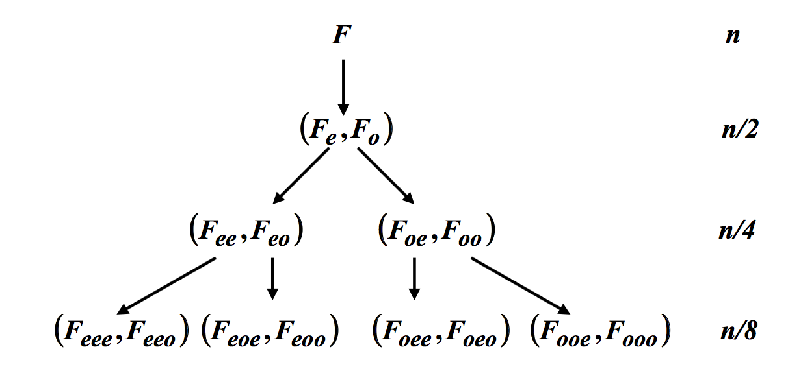

### B - Bit Reversal
In order to determine which image data f(x) is to be used for `Fe` , `Fo` , `Fee` , `Feo` , etc., we perform bit reversal, as the following table demonstrates:
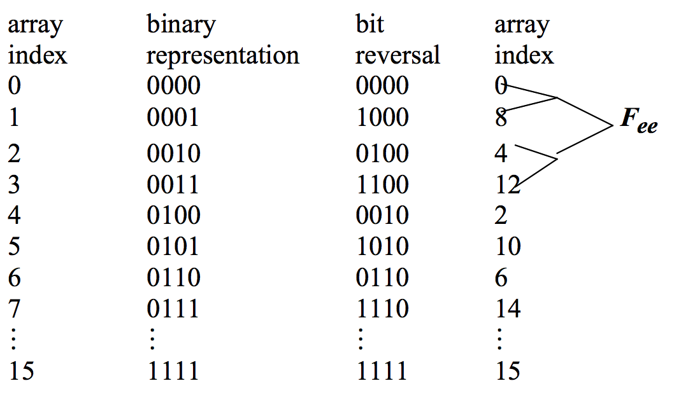

### C - Ringing
The ringing effect is due to sharp and sudden change in the filter characteristics, which comes from the sharp cutoff of the frequency domain. In order to avoid ringing, we can use a low pass filter with a transfer function that falls smoothly to zero. Butterworth has proposed the following filter transfer function for this purpose.

### D - Spectrum
The power spectrum, also referred to as the amplitude spectrum contains the magnitude information of an image. Without it, we cannot determine the relative brightness of an image, since we only have the phase information at hand.

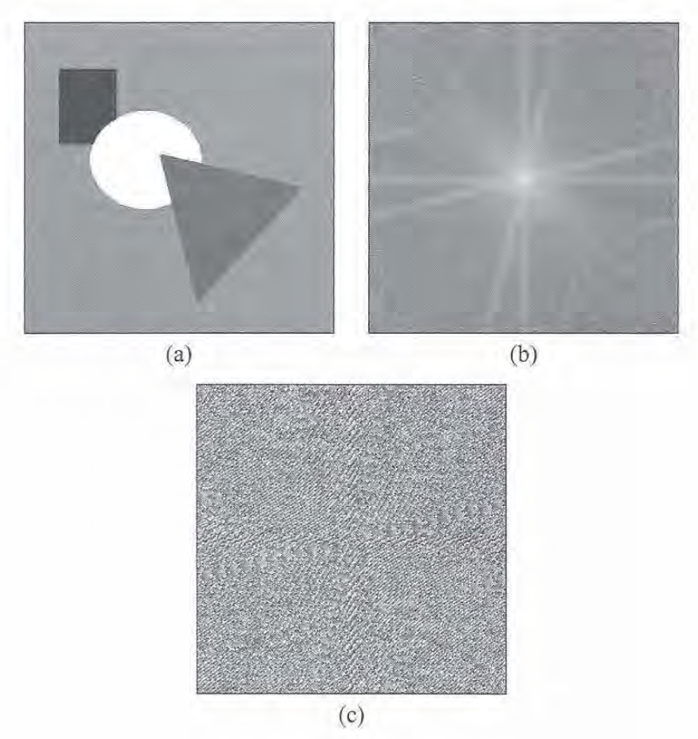

In the images above the source image (a) is broken down into the phase spectrum (b) and the amplitude/power spectrum (c). If we destroy either one of these, we cannot reconstruct the original image, as shown below. Image a shows the result of destroying the phase information, while image b shows the result of destroying the amplitude information.

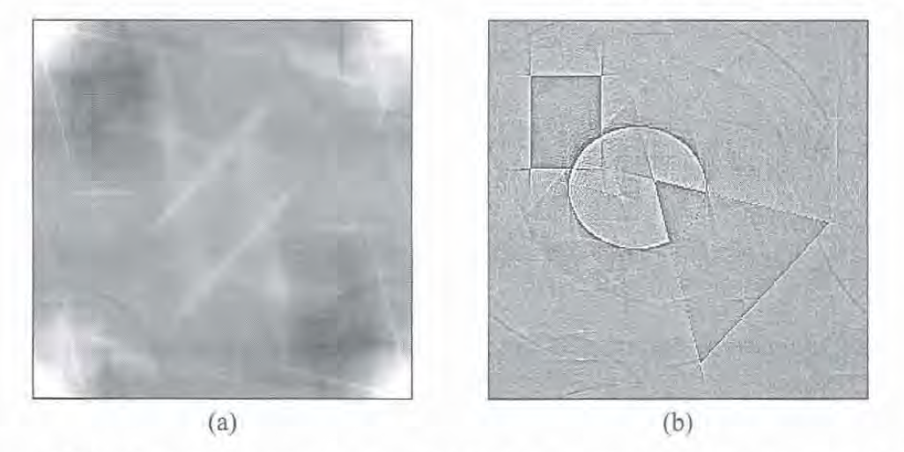

## 2. Low Pass Filtering
Mean filtering works well for random (salt and pepper noise), but does little in the ways of dealing with Frequency Based Noise (like sinusoidal noise). We see that in both the first blonde and the zebra, both methods are equally as effective in reducing the noise, while the second blonde image sees little improvement from the mean filter, while the Butterworth filter takes a chunk out of the noise. This performance could be improved with some tweaking of the order and the cutoff of the Butterworth Filter.

Original Image | Butterworth Image | Mean Filtered Image
:------------- | :---------------- | :------------------
 | 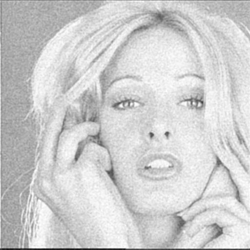 | 
 | 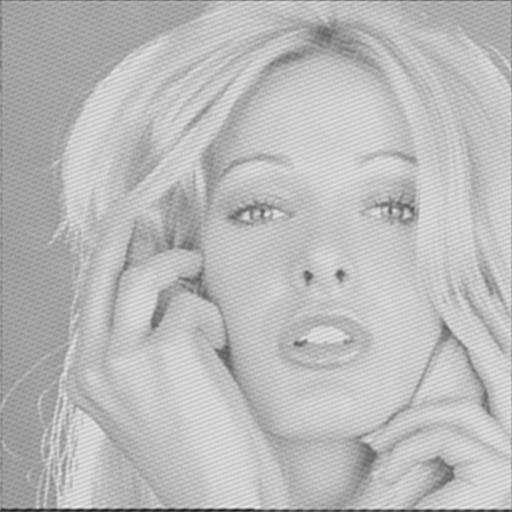 | 
 | 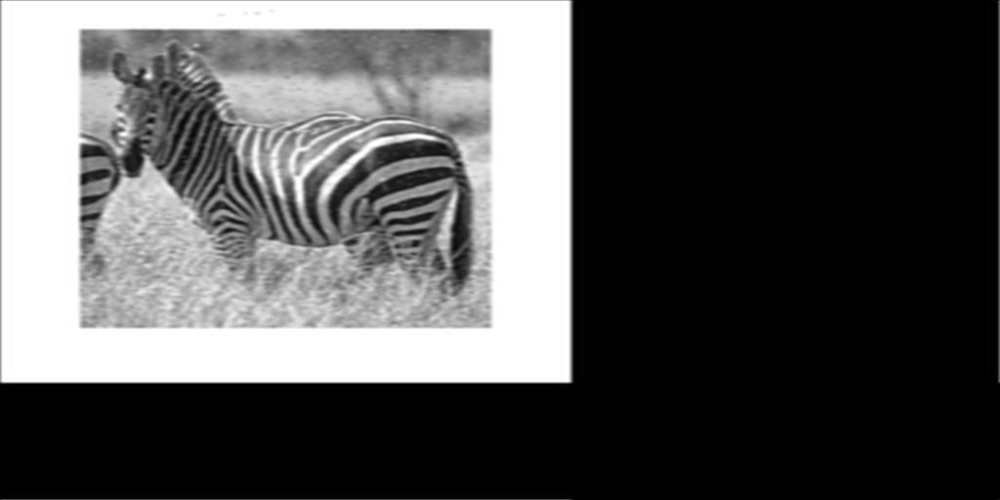 | 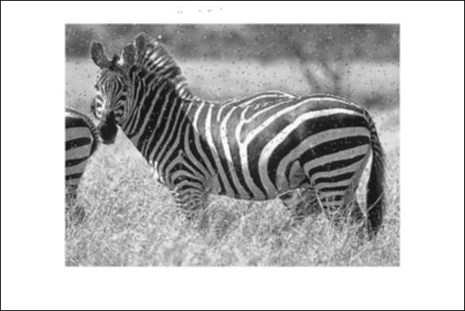

Spectrum analysis both before and after Butterworth Low Pass filtering the images.

Source File    | Spectrum Before | Spectrum After
:------------- | :-------------- | :-------------
 | 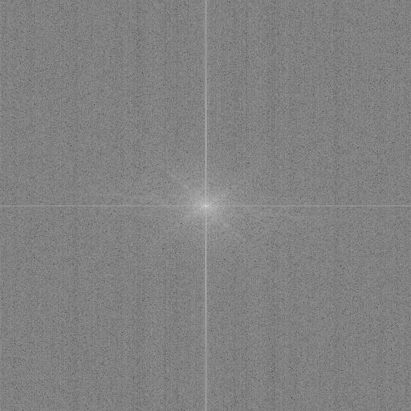 | 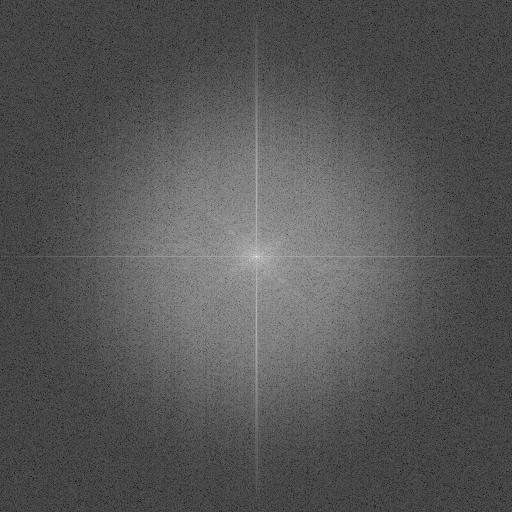
 | 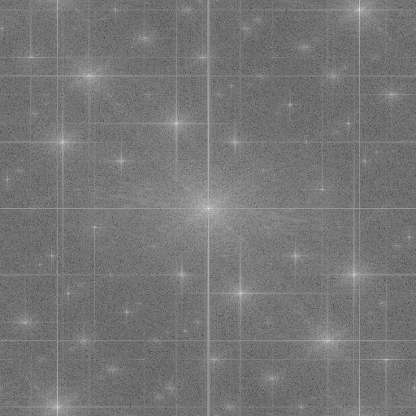 | 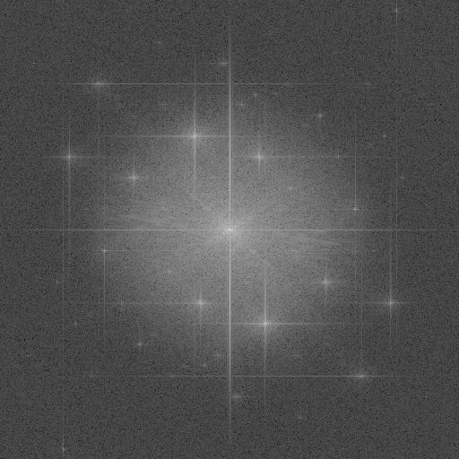
 | 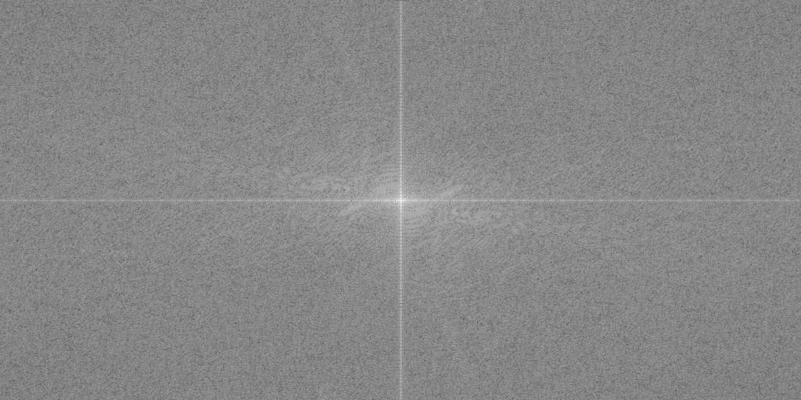 | 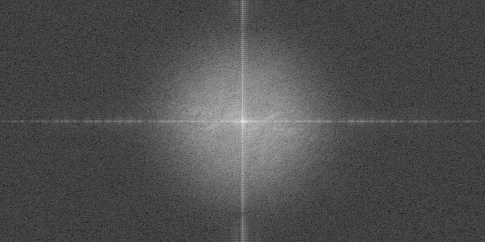

## 3. High Pass Filters

We find that the higher the cutoff, the sharper the image is. With the input image being blurry to begin with, we see little difference with a low cutoff (like .1) and see a much sharper image with the pedals of the flower being much more defined with cutoffs > .5.

.1 | .25 | .35 | .5 | .75
:- | :-- | :-- | :- | :--
 | 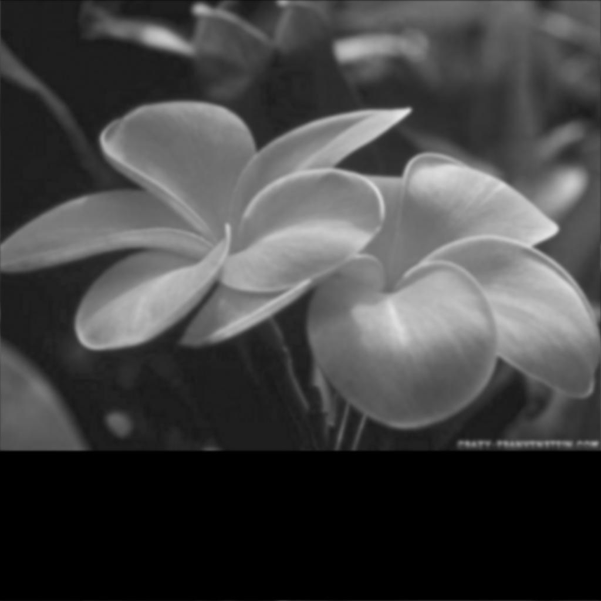 |  |  | 

## 4. Gaussian High Pass Filtering
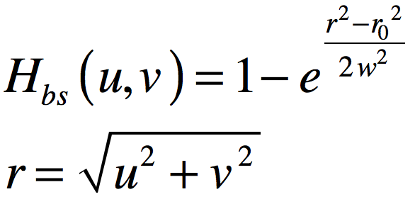

Using this method, we can find the noise in the `Blonde2.jpg` image which has sinusoidal noise. This could then be used to remove all of the noise in the image with some further adjustments.

 Source  | Processed     
 :------ | :--------
 | 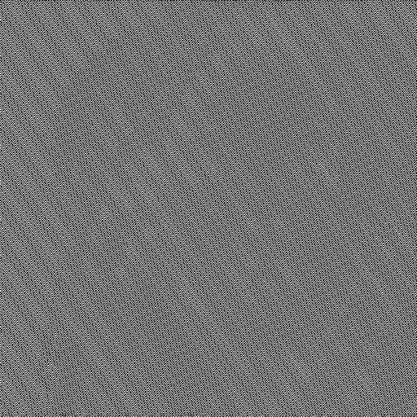      
