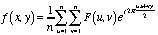

CS-559 Homework 1
=================

## 1. Similarity Between Pixels
In order to compare two square regions between two images, I would first find the average RBG Color of the regions. Second, convert the computed average to HSL Saturation and Lightness values which can then be compared. Refer to `CompareRegions.java` and `CompareRegionstest.java` for the Implementation and Testing of the aforementioned comparison method.

This method emphasizes differences in color, rather than saturation and brightness. As a result, colors that vary only by shade will have a much higher comparison score, where as colors that are radically different, like Black and White will yield a much lower comparison score.

## 2. PCB Visual Inspection
Given that the board we are inspecting has a size of 60mm square, a minimum defect size is .4mm, which must be represented by a 6 pixel square, and a sensor with photo-sites of 5μm, with a 1μm isolation gap between them; we find that...

Given that the board(60x60mm) must fill the sensor, and the minimum defect must be .4mm, we can find that the minimum resolution of the sensor must be 900x900px. From this we can determine that we will be using a 1024x1024px sensor for this application, since it is the smallest sensor that has a resolution greater than 900x900px.

Next, we can calculate the size of the image sensor, using the newly derived minimum resolution and the given CCD sensor specifications.

| Lens Focal Length | Distance between Sensor and PCB |
| :---------------- | :------------------------------ |
| 25 mm             | 269.180 mm                      |
| 35 mm             | 376.853 mm                      |
| 50 mm             | 538.360 mm                      |

From this we find that we can used either the 25mm or the 35mm lens with a 1024x1024px sensor to inspect the boards, with a distance of 269mm or 377mm from the board respectively; since the camera can be at most 500mm away from the inspection piece and must be at least 200mm away, as specified by the problem.

## 3. Quantization
Please refer to `Quantization.java` and `QuantizationTest.java` for the Implementation and Testing of the Quantization algorithm.

Quantization it the process by which the number of bits used to represent each of the images constituent color channels (R, G, B) is reduced to reduce the overall size of the image. As a result, the number of color options (aka. the color depth) is reduced as is evident in the two images below.

The Image above has a color depth of 3-bits per channel. While the image still is in 24-bit color, which is due to the color profile used by the Buffered Image and `java.awt.*` package, the last 5 bits of each channel are 0 for the image above.

The image above has a color depth of 7-bits per channel, and we can see how many more color options there are in this photo. There are still quite a few colors missing when compared to the source image, but the difference in quality and color variation is evident.

## 4. Enlarging

## Image Credit
Elemaki (Own work) [[GFDL](http://www.gnu.org/copyleft/fdl.html) or [CC BY-SA 3.0](http://creativecommons.org/licenses/by-sa/3.0)], [via Wikimedia Commons](https://commons.wikimedia.org/wiki/File%3A02.Trinidad_(59).JPG)  

Ralf Roletschek [[GFDL](http://www.gnu.org/copyleft/fdl.html) or [CC BY-SA 3.0](http://creativecommons.org/licenses/by-sa/3.0)], [via Wikimedia Commons](https://commons.wikimedia.org/wiki/File%3A13-08-09-peak-by-RalfR-01.jpg)
