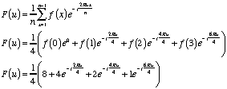

AssumingCS-559 Homework 1
=================

## 1. Image Formats
#### A. What is an Interchange Format?
An interchange format is a format designed to facilitate the exchange of image data between users, and to be usable with different hardware and software. One of the core features of images encoded with these formats is compression, which allows the the essentially same image to be sent, which have a drastically smaller size.

#### B. Three Examples of Interchange Formats
Examples include:
1. GIF - Graphic Interchange Format
2. TIFF - Tagged Image File Format
3. PNG - Portable Network Graphic

#### c. What is the signature of a PGM format (w/ 2 examples)
The Signature of a Portable Grayscale Format (PGM) image could be one of the following:

| Signature      | Image Type     | Storage Type   |
| :------------- | :------------- | :------------- |
| P1             | Binary         | ASCII          |
| P2             | Grayscale      | ASCII          |
| P3             | RGB            | ASCII          |
| P4             | Binary         | Raw Byte       |
| P5             | Grayscale      | Raw Byte       |
| P6             | RGB            | Raw Byte       |

## 2. Printing Images
#### A. What is patterning in printing?
In printing, patterning is process used to achieve gray level images via a matrix of pixels whose density varies according to the desired darkness of region.

#### B. What is a dither matrix and how is it used?
Dithering is a method of thresholding an image to calculate the areas that should be printed and those that should not in order to achieve a gray level pixel on a Black & white printing process. The size of this matrix, which is always square, varies depending on the desired number of gray-levels (color depth). In use, the matrix is "laid" over the image, and the output pixel becomes white if the values is greater than the value of the matrix element, otherwise it is black.

#### C. Explain the principle and operation of error diffusion for printing.
Error Diffusion distributes the error, which comes from printing only white or black, across the neighbors of pixels in order to achieve the most realistic reproduction of the image.

A threshold is selected, usually 1/2 the possible values of the pixel, 128 in the base of an 8-bit image, and pixels with a value greater than that will be printed in white. Next the error that is derived from this (say the pixel value is 130, the error would be 130-255 = -125) is distributed across the neighboring pixels with a scale factor.

## 3. Look Up Tables (LUTs)
Lookup tables allow for the processing of images at at complexities less than (n x n). This is achieved by pre-computing all the possible grayscale levels (L) for the transformation that will be run. Lookup tables are almost always more efficient that running the transformation for each individual pixel, provided that the following holds:

That is, there are more pixels than there are possible Gray-level values for the transformation being run, with a given color depth.

## 4. Contrast Stretching

## 5. Histograms

---
### Running Programs
Each program has an associated JUnit Unit Test in the `src/test` directory, which tests the specified program for the outlined parameters. These unit tests can be run via the Gradle Dependency and Build tool, whose wrapper is included in the root directory of this project.

Running the line below in a Unix terminal while at the root directory of the project will execute all of the unit tests and show the results:
`./gradlew clean build test`

---

## Program A - Motion of a Moving Car

In order to calculate the speed of a vehicle from two images, assuming that our frame of reference does not change (eg. the camera does not move), we must find the distance traveled by the vehicle over a given time period. To do this, we first find the distance traveled by identifying the areas of change in the image by subtracting one from the other, which yields the result shown below.

Assuming that car is traveling from left to right in a mostly straight line, we find break down the image into a single column, whose values are shown below.

By finding the two local maxima, we can identify the position of the car, and calculate the difference in the position of each of these maxima to identify the distance traveled, in pixels, between the two exposures. Finally, we can use the formula below to convert the distance traveled, provided that we know the time between exposures, into a common measurement, like fps (feet per second). This metric can be then converted to other velocity measures, like mph, kph, etc.

## Program B - Histogram Calculation and Rendering
