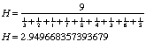

CS-559 Homework 3
=================
## 1 - High / Low Pass Filters
### A)
The combination (addition) of the absolute values of the High- and Low-pass filters applied to an image will yield a sum of 1, since all frequencies are being included. This assumes that the High- and Low-pass filters are complementary and do not omit common frequency ranges). It follows that applying both a high and low pass filter to an image, will result in the null image (all 0s). With some basic manipulations, we can rearrange this relationship to show that the the source image, less the image that was processed through the low-pass filter will produce the image as if it was processed by the high-pass filter.


### B)

Gaussian, its derivations, and linear filters are separable, since they are applied equally and uniformly across the entire image. Wherein other filters, like Laplacian filters are non-separable due to their use of derivations in the convolution to yield the resulting high- or low-pass filtered image. Separable filters are generally easier to compute, due to the low complexity of the convolution mask.

## 2 - Masks
### A)
Source: [3, 2, 1, 7, 8, 4, 3, 6, 5]

Median: 4


### B)


Source: [3, 2, 1, 7, 8, 4, 3, 6, 5]



Harmonic Mean: 2.949668357393679

### C) Application to Gaussian Noise

Because Gaussian noise is distributed normally, wherein there are fine-scaled image edges across the image which can be reduced/eliminated with smoothing, which is what is accomplished by the two masks discussed above. In the case of the provided matrix, the Median method method is more likely to produce the desired result, and will likely be the case for images with less than 50% noise. However, for very noisy images, like photos taken in low-light, a harmonic mean would likely yield better results, since it is better for values that vary greatly, like the variance that stems from electronic circuit noise.

## 3 - Sobel Edge Detection

Using a threshold of 1...

**Horizontal (x)**
```
0   0   0   0   0   0   0   0
0   0   0   0   0   0   0   1
0   0   0   0   0   0   1   0
0   0   0   0   0   1   0   0
0   0   0   0   1   0   0   0
0   0   0   1   0   0   0   0
0   0   1   0   0   0   0   0
0   1   0   0   0   0   0   0
```

**Vertical (y)**
```
0   0   0   0   0   0   0   0
0   0   0   0   0   0   0   1
0   0   0   0   0   0   1   0
0   0   0   0   0   1   0   0
0   0   0   0   1   0   0   0
0   0   0   1   0   0   0   0
0   0   1   0   0   0   0   0
0   1   0   0   0   0   0   0
```

**Both**
```
0   0   0   0   0   0   0   0
0   0   0   0   0   0   0   1
0   0   0   0   0   0   1   0
0   0   0   0   0   1   0   0
0   0   0   0   1   0   0   0
0   0   0   1   0   0   0   0
0   0   1   0   0   0   0   0
0   1   0   0   0   0   0   0
```

## 4 - Laplacian
### A)


Laplacian is rarely used on its own for edge detection since it is prone to corruption by noise due to the second derivative. It is used in conjunction with a Gaussian filter to first reduce the noise (and blur the image), followed by the application of the Laplacian.

### B)


This mask approximation is even more prone to corruption by noise, since it covers 4 times the area (since each of the edges are twice as long). It fails for the same reason that the initial mask does, but much more readily.

## 5 - Fourier Transform


## 6 - FFT
### A)
Because of the periodicity of F(u,v), we need to shift the Fourier Transform by half of one period, to ensure that the entire spectrum is shown and processed.


### B)
When performing an FFT, it is necessary to reverse the bits to correctly identify the array position of the data that will be processed by the FFT. It allows for the correct combination of sequences to perform the FFT. Thus, before performing an FFT, the image function, f(x) myst be reordered to ensure that the resulting FFT is correct.

### C)
If F(u,v) is known, then f(x,y) can be calculated using the following formula:


### D)

The Fast Fourier Transform (FFT) method takes advantage of the separability of the Fourier Transform, which allows us to break apart the two dimensional FFT into a one-dimensional sum along each row of the image. This intermediary result is then taken into another one-dimensional FFT going down each column of the intermediary array. This is possible because a Fourier transform of length N can be split into the sum of two Fourier transforms each of length N/2. Given that N is a power of 2, this process can be applied recursively until the length of the computer transformation is 2.

Being able to break the two-dimensional transform into two one-dimensional transforms takes the transformation from O(n^2) complexity to O(n log n) complexity, which drastically reduces the computation time for images with higher resolutions.

---

## Programming Task A
We can apply a Sobel Edge Detection Method with varying thresholds to the provided images. This method yields good results for simple images (those with clear borders between areas), but doesn't work as well with overlapping colors.


We can also apply this method to each of the individual channels of the image, and then merge the results together. This works better in the case of `peppers1`, since the border between the areas is not white, rather different colors.


## Programming Task B

Adding Salt and Pepper noise can wreak havoc on edge detection if the image is not filtered first. Using a simple median filter, we can reduce the number of false edges almost completely.


```java
public static BufferedImage medianFilter(BufferedImage image) {
    Color[] pixel = new Color[9];
    int[] R = new int[9];
    int[] B = new int[9];
    int[] G = new int[9];

    for (int i = 1; i < image.getWidth() - 1; i++)
        for (int j = 1; j < image.getHeight() - 1; j++) {
            pixel[0] = new Color(image.getRGB(i - 1, j - 1));
            pixel[1] = new Color(image.getRGB(i - 1, j));
            pixel[2] = new Color(image.getRGB(i - 1, j + 1));
            pixel[3] = new Color(image.getRGB(i, j + 1));
            pixel[4] = new Color(image.getRGB(i + 1, j + 1));
            pixel[5] = new Color(image.getRGB(i + 1, j));
            pixel[6] = new Color(image.getRGB(i + 1, j - 1));
            pixel[7] = new Color(image.getRGB(i, j - 1));
            pixel[8] = new Color(image.getRGB(i, j));
            for (int k = 0; k < 9; k++) {
                R[k] = pixel[k].getRed();
                B[k] = pixel[k].getBlue();
                G[k] = pixel[k].getGreen();
            }
            Arrays.sort(R);
            Arrays.sort(G);
            Arrays.sort(B);
            image.setRGB(i, j, new Color(R[4], B[4], G[4]).getRGB());
        }

    return image;
}
```
